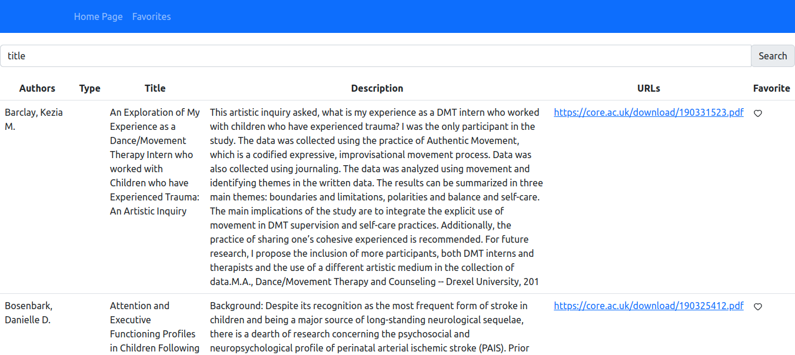
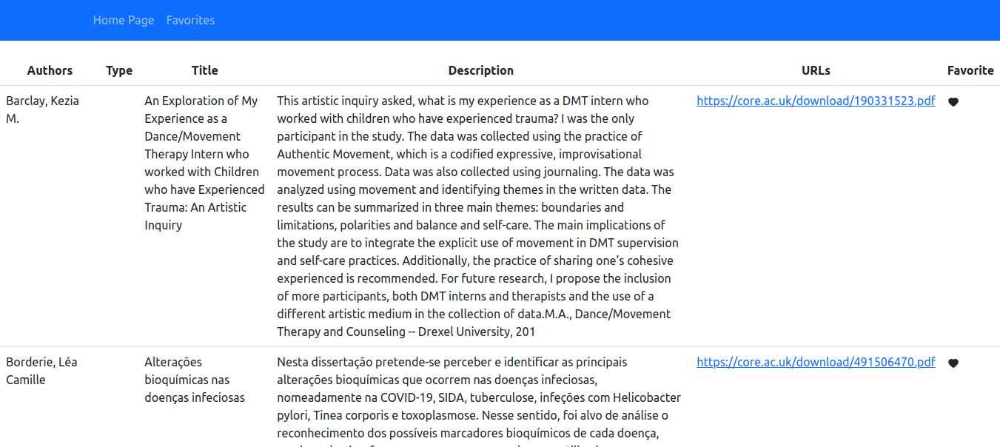
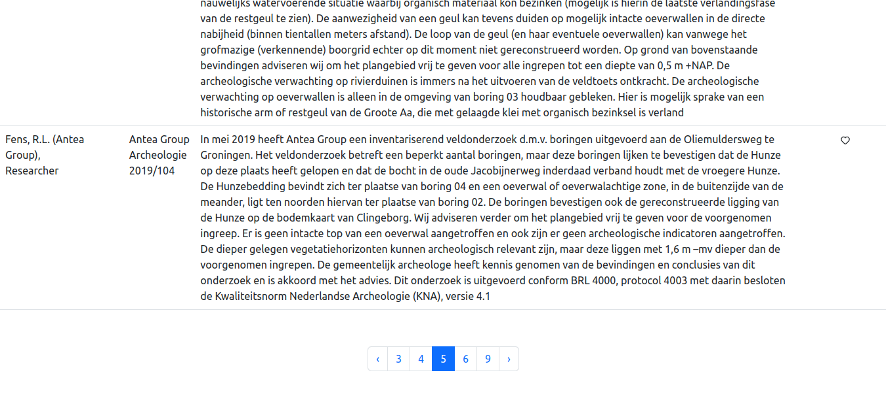

# Boas vindas ao repositório do projeto Scientific Articles

---

## Descrição do Projeto

Neste projeto eu criei uma aplicação Front-End utilizando React com TypeScript onde é possível:
- Realizar buscas por artigos científicos na API do portal CORE;
- Marcar e desmarcar os resultados da pesquisa como favorito;
- Mostrar uma listagem com os artigos favoritados;
- Mostrar os resultados das buscas e dos artigos favoritados com paginação.

---

## Imagens da Aplicação

Página de busca
<br/>

<br/>
<br/>
Página com artigos favoritos
<br/>

<br/>
<br/>
Paginação
<br/>

<br/>

---

## Requisitar chave de uso

Para solicitar a chave de uso que será utilizada no arquivo **.env** que você irá criar acesse a seguinte página:
```
  https://core.ac.uk/services/api/
```
Após clique em **Register now**, informe o seu e-mail e clique novamente em **Register now** e siga as orientações recebidas no e-mail informado.
<br/>
<br/>
Caso queira consultar a documentação da API utilizada no projeto basta acessar:
```
  https://core.ac.uk/docs/#!/all/search
```

---

## Instalação do projeto localmente

1. Abra o terminal e realize o clone do projeto:
```javascript
  git clone git@github.com:Humberto-Bonadiman/scientific-articles.git
```

2. Acesse o diretório do projeto e depois utilize o comando **npm install** para instalar todas as dependências necessárias:
```javascript
  cd scientific-articles
  npm install
```

3. Crie um arquivo **.env** e repasse os dados o valor da chave de acesso dentro de **REACT_APP_API_KEY**:
```javascript
  touch .env
```
O valor dentro do arquivo deve estar parecido com o arquivo **.env.example**:
```javascript
  REACT_APP_API_KEY=sua_api_key_vai_aqui
```

4. Por último, rode o comando **npm start** e acesse o projeto via browser, no caminho http://localhost:3000/.
```javascript
  npm start
```

---

## Rodar os testes da aplicação

Observação: Para rodar os testes é necessário que a aplicação esteja funcionando (digitar npm start no terminal).

Para rodar os testes da aplicação utilize o comando **npm run cypress:open** no terminal:
```javascript
  cypress:open
```
Após digitar este comando o Cypress irá abrir. Clique na opção **E2E Testing** e selecione o navegador de sua preferência. Assim que o navegador abrir clique em **specs** na barra lateral (a 2ª opção) e selecione uma das opções de teste.

<br/>
Também é possível realizar digitando **npm run cy:run** no terminal.

---
